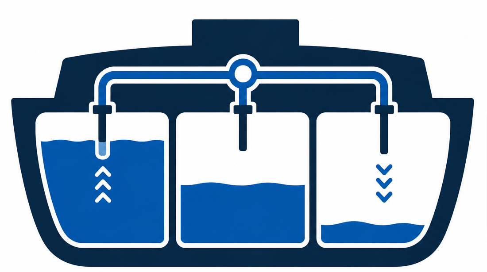

<p align="center">
  
</p>

# Ballast

[](https://snyk.io/test/github/Tight-Line/ballast)
[](https://sonarcloud.io/summary/new_code?id=Tight-Line_ballast)
[](https://codecov.io/gh/Tight-Line/ballast)

Ballast is a Kubernetes operator that automatically right-sizes workload resource requests and limits based on real operational history. It is a more active alternative to [Fairwinds Goldilocks](https://github.com/FairwindsOps/goldilocks): rather than suggesting changes, it applies them — at admission time and on running pods via in-place resize (Kubernetes 1.35+).

## How it works

Workloads opt in with annotations on their pod templates. Ballast observes real CPU, memory, and ephemeral-storage utilization, accumulates a rolling history keyed to a *workload identity tuple* (a set of pod labels you configure), and uses that history to right-size all three resources:

1. **Measure** — collect per-container usage samples into a time-series store (Redis/Valkey).
2. **Apply** — patch resource requests and limits at admission time when a pod is created.
3. **Resize** — adjust resources on running pods via the Kubernetes in-place resize API (1.35+).

`autoresize` is shorthand for all three: it enables measure, apply, and resize with a single annotation. Nothing is applied or resized until the `WorkloadProfile` meets its readiness threshold — that is normal behavior for any resize-enabled workload.

Pod eviction for cluster rebalancing is handled by [Kubernetes Descheduler](https://github.com/kubernetes-sigs/descheduler) — see the Annotation Contract section for details.

## Prerequisites

- Kubernetes 1.35+ (required for in-place pod resize; earlier versions support measure and apply but not resize)
- [metrics-server](https://github.com/kubernetes-sigs/metrics-server) installed in the cluster (source for CPU and memory; ephemeral-storage usage comes from the kubelet Summary API and needs no extra component)
- TLS certificate for the admission webhook (see [Webhook TLS](#webhook-tls) below)
- A Redis-compatible store (Ballast ships with a bundled Valkey via Helm; an existing Redis or Valkey instance works too)

## Installation

cert-manager must already be installed in the cluster (Ballast does not install it):

```bash
helm repo add ballast https://tight-line.github.io/ballast
helm repo update

helm install ballast ballast/ballast \
  --namespace ballast-system \
  --create-namespace
```

The chart ships with a sensible default for `ballastConfig.identityLabels` (`app.kubernetes.io/name` + `app.kubernetes.io/component`). Read the section below before overriding it — the choice has cluster-wide consequences.

Upgrades are `helm upgrade --install` with no extra steps. CRDs are kept in sync automatically: Helm itself never upgrades the `crds/` directory, so the chart runs a pre-install/pre-upgrade hook Job (`ballastd apply-crds`) that server-side-applies the CRD manifests baked into the operator image. Set `crds.upgradeHook.enabled: false` to opt out if external tooling manages CRDs; you are then responsible for applying `config/crd/bases/` on every upgrade.

## WorkloadProfile Identity

Ballast groups pods into `WorkloadProfile` objects by matching a configurable set of pod label keys called the **identity tuple**. The tuple is defined once in `BallastConfig.spec.identityLabels` and applies to every namespace in the cluster.

**WorkloadProfiles are cluster-scoped.** Every pod in every namespace that shares the same label values for the identity keys feeds measurements into the same profile. This is intentional: forty dev namespaces all running the same billing app produce one well-sampled `WorkloadProfile`, not forty thin ones.

### Default: `name` + `component`

```yaml
ballastConfig:
  identityLabels:
    - app.kubernetes.io/name
    - app.kubernetes.io/component
```

This works well for clusters that run a single environment class. The frontend and backend of the same app get separate profiles; forty developers' copies of billing all contribute to the same `(billing, api)` profile.

### Mixed environments in the same cluster

If your cluster runs dev, staging, and production side-by-side and you want separate profiles per environment, add `ballast.tightlinesoftware.com/resource-profile` to the identity tuple and apply it to your pods:

```yaml
# BallastConfig / Helm values
ballastConfig:
  identityLabels:
    - app.kubernetes.io/name
    - app.kubernetes.io/component
    - ballast.tightlinesoftware.com/resource-profile
```

```yaml
# Pod template labels
labels:
  app.kubernetes.io/name: billing
  app.kubernetes.io/component: api
  ballast.tightlinesoftware.com/resource-profile: prod
```

Now `(billing, api, prod)` and `(billing, api, dev)` are measured independently. Pods without the `ballast.tightlinesoftware.com/resource-profile` label get a placeholder value in the profile name (`noresourceprofile`) rather than being skipped, so opted-in pods always produce a profile.

> **Changing `identityLabels` wipes your operational history.** It redefines what constitutes a workload identity, so all existing `WorkloadProfile` objects are renamed and their accumulated Redis history is orphaned. Ballast starts fresh from zero samples. Plan your tuple before enrolling workloads.

## Annotation Contract

Add these annotations to your pod template specs to enroll workloads. Ballast never acts on a workload without explicit opt-in.

| Annotation | Meaning |
|---|---|
| `ballast.tightlinesoftware.com/measure: "true"` | Collect metrics; required for any other behavior |
| `ballast.tightlinesoftware.com/apply: "true"` | Patch requests/limits at admission time; requires `measure` |
| `ballast.tightlinesoftware.com/resize: "true"` | Adjust resources on running pods via in-place resize; requires `apply` |
| `ballast.tightlinesoftware.com/autoresize: "true"` | Shorthand for `measure` + `apply` + `resize`; mutually exclusive with `apply` and `resize` |

**`apply` and `resize` do not cover the same resources.** At admission time the webhook can set *any* recommended resource — cpu, memory, ephemeral-storage — because it patches the pod spec before the pod exists. In-place resize is narrower by Kubernetes design: the pod resize subresource ([KEP-1287](https://github.com/kubernetes/enhancements/tree/master/keps/sig-node/1287-in-place-update-pod-resources)) permits mutating only `cpu` and `memory` on a running pod, and rejects a patch that touches anything else. Ballast therefore excludes all other resources from resize patches. In practice this means an `ephemeral-storage` recommendation takes effect only when a pod is recreated (via `apply`), never in place; a running pod whose ephemeral-storage drifts will keep its current value until its next restart. Ballast logs every exclusion; when non-resizable drift is the *only* drift on a pod (so no resize is issued at all), it also records `ballast.resize.skipped{reason="not_resizable"}` — skip reasons always describe the whole pod, never a single resource axis.

**`resize` cannot change a pod's QoS class.** A pod's QoS class (`BestEffort`, `Burstable`, `Guaranteed`) is fixed at creation, and the resize subresource rejects any patch that would change it. Two recommendation shapes run into this: a `BestEffort` pod (no requests or limits on any container) can never gain requests in place, and a `Guaranteed` pod (requests equal to limits for cpu and memory everywhere) can only be resized by moving requests and limits together. Ballast detects both before patching and records `ballast.resize.skipped{reason="qos_pinned"}` instead of attempting a resize that cannot succeed; the recommendation still applies at admission time (via `apply`) when the pod is next recreated. When a resize fails for a reason Ballast could not predict, the pod is annotated `ballast.tightlinesoftware.com/resize-blocked` with the error text plus `resize-blocked-at` with the failure time, and further attempts are skipped (`reason="blocked"`) until one resize interval has elapsed; a later successful resize clears both annotations.

**Pod eviction** is deliberately out of scope for Ballast. Ballast keeps resource requests and limits accurate; cluster rebalancing based on those corrected values is best handled by [Kubernetes Descheduler](https://github.com/kubernetes-sigs/descheduler) (specifically its `LowNodeUtilization` strategy). This is a clean division of labor: Ballast gets the weight right, Descheduler decides where pods should sit.

**Example — full automation:**

```yaml
spec:
  template:
    metadata:
      labels:
        app.kubernetes.io/name: billing
        ballast.tightlinesoftware.com/resource-profile: prod
      annotations:
        ballast.tightlinesoftware.com/autoresize: "true"
```

**Example — measure only (safe first step):**

```yaml
spec:
  template:
    metadata:
      annotations:
        ballast.tightlinesoftware.com/measure: "true"
```

### Which workloads to enroll

Ballast right-sizes **long-running** workloads by learning their steady-state usage over hours or days (default readiness: 250 samples over 24 hours). Enroll Deployments, StatefulSets, DaemonSets, and similar controllers whose pods run continuously.

- **Job pods: you almost certainly do not want to annotate them.** A Job runs to completion, often in seconds or minutes, so it never accumulates enough steady-state history to cross the readiness threshold. Annotating a Job's pod template only creates a `WorkloadProfile` that never produces a recommendation. Ballast will not stop you (opt-in is entirely under your control), but there is nothing to gain and it clutters your profiles.
- **CronJob pods: think hard before annotating them.** A CronJob creates Jobs, and those Jobs create the pods (`CronJob → Job → Pod`), so CronJob pods carry the same run-to-completion caveat as any other Job pod. Annotate them only if each run is genuinely long-lived and resource-stable enough to measure meaningfully — for example, a multi-hour nightly batch job. A short or spiky periodic task is a poor fit and will mostly generate noise.

**Only regular containers are right-sized today.** Even on an enrolled pod, Ballast measures and resizes only the pod's regular `spec.containers`. It excludes **all init containers and ephemeral debug containers** from measurement — there is no per-container knob to configure; the exclusion is automatic. Note this is broader than ideal: restartable-init "native sidecar" containers (`restartPolicy: Always`) are long-running and would be good right-sizing targets, but they are excluded for now because the apply and resize paths only patch `spec.containers`. Support for right-sizing restartable-init sidecars is tracked in [#30](https://github.com/Tight-Line/ballast/issues/30).

## Verifying a WorkloadProfile

Once a pod with the `measure` annotation is running, Ballast creates a `WorkloadProfile` for its identity tuple. Check it with:

```bash
kubectl get workloadprofiles
kubectl describe workloadprofile billing--api--prod
```

The profile status shows accumulated usage statistics and recommendations once the readiness threshold is met (default: 250 samples collected over 24 hours). CPU, memory, and ephemeral storage are all tracked and sized:

```yaml
status:
  containers:
    - name: app
      usageStats:
        - resource: cpu
          samples: 288
          mean: "230m"
          p95: "240m"
          p99: "310m"
          cv: "0.46"
        - resource: memory
          samples: 288
          mean: "180Mi"
          p95: "210Mi"
          p99: "240Mi"
          cv: "0.21"
        - resource: ephemeral-storage
          samples: 288
          p90: "1200Mi"
          p99: "1800Mi"
          cv: "0.33"
      recommendations:
        cpu:
          request: "288m"     # avg * 1.25 headroom
        memory:
          request: "225Mi"    # avg * 1.25 headroom
          limit: "288Mi"      # p99 * 1.2
        ephemeral-storage:
          request: "1200Mi"   # p90
          limit: "2160Mi"     # p99 * 1.2
  meetsThreshold: true
  activeWorkloads: 3
```

## Kill Switch

Create a ConfigMap named `ballast-kill-switch` in the operator namespace to immediately halt all Ballast activity without a restart:

```bash
# Halt all Ballast activity
kubectl create configmap ballast-kill-switch -n ballast-system

# Resume
kubectl delete configmap ballast-kill-switch -n ballast-system
```

All suppressed actions are logged at `warn` level with `kill_switch: true`. Pod admission continues normally (webhook passes pods through without mutation).

For planned, GitOps-managed suspension, set `BallastConfig.spec.suspended: true` instead.

## Webhook TLS

Kubernetes requires the admission webhook server to present a TLS certificate trusted by the API server. Ballast supports three approaches, in order of preference:

**1. cert-manager (default)**

The Helm chart creates a self-signed `Issuer` and a `Certificate` resource. cert-manager provisions the cert, mounts it into the operator pod, and injects the CA bundle into the `MutatingWebhookConfiguration` automatically. This works on air-gapped clusters — no DNS or HTTP challenge, no external CA.

Requires [cert-manager](https://cert-manager.io) already installed in the cluster (Ballast uses it but does not install it). If cert-manager is already present — a common case — no extra setup is needed.

```yaml
# values.yaml (default)
certManager:
  enabled: true
```

**2. Kubernetes CertificateSigningRequest (future improvement)**

A Helm pre-install Job submits a CSR to the cluster's built-in CA. The resulting cert is written to a Secret that the operator mounts. No cert-manager dependency, but requires the Job's ServiceAccount to have `certificates.k8s.io/approve` permission — which some clusters restrict, requiring manual `kubectl certificate approve`.

Not yet implemented; tracked as a future Helm chart improvement.

**3. User-provided certificate (future improvement)**

Supply your own cert material (e.g. from an internal PKI or Vault) via Helm values. The chart skips cert-manager and CSR resources entirely and uses the provided Secret directly. The `caBundle` in the `MutatingWebhookConfiguration` must be set to the corresponding CA cert.

Not yet implemented; tracked as a future Helm chart improvement.

## Default MetricsSource and ClusterResourcePolicy

A fresh `helm install` ships three objects out of the box so measurements work without any extra setup: two `MetricsSource` objects (CPU/memory and ephemeral storage) and one catch-all `ClusterResourcePolicy`.

### MetricsSource: `kubernetes-metrics`

```yaml
spec:
  type: kubernetesMetrics
  config:
    pollInterval: "300s"
    reservoirSize: 10000
```

This wires Ballast to the cluster's [metrics-server](https://github.com/kubernetes-sigs/metrics-server) (which must already be installed — it is not bundled) for CPU and memory. Samples are collected every 5 minutes and up to 10,000 samples per container per metric are retained in Redis.

### MetricsSource: `kubelet-summary`

```yaml
spec:
  type: kubeletSummary
  config:
    pollInterval: "300s"
    reservoirSize: 10000
```

This reads ephemeral-storage usage from the kubelet Summary API (via the API server proxy). No extra credentials are needed beyond the Ballast ServiceAccount.

To opt out of either source and manage `MetricsSource` objects yourself, set `enabled: false` on the relevant entry:

```yaml
# values.yaml
defaultMetricsSources:
  kubernetesMetrics:
    enabled: false
  kubeletSummary:
    enabled: false
```

### ClusterResourcePolicy: `default`

This is the `homogeneous-large-fleet` preset, the chart's built-in default:

```yaml
spec:
  priority: 0
  metrics:
    - resource: cpu
      field: request
      source: kubernetes-metrics
      aggregation: avg
      headroom: "1.25"
    - resource: memory
      field: request
      source: kubernetes-metrics
      aggregation: avg
      headroom: "1.25"
    - resource: memory
      field: limit
      source: kubernetes-metrics
      aggregation: p99
      headroom: "1.2"
    - resource: ephemeral-storage
      field: request
      source: kubelet-summary
      aggregation: p90
      headroom: "1.0"
    - resource: ephemeral-storage
      field: limit
      source: kubelet-summary
      aggregation: p99
      headroom: "1.2"
  readiness:
    minDataPoints: 250
    minTimeSpan: "24h"
    maxCV: "1.5"
    cvMeanFloor:
      cpu: "25m"
      memory: "25Mi"
      ephemeral-storage: "2Mi"
  behaviors:
    thresholds:
      default: "20%"
    resize:
      maxChangePerCycle: "50%"
      interval: "15m"
```

This catch-all policy applies to every opted-in pod in the cluster. Key design decisions:

- **Requests at `avg * 1.25`.** Sizing CPU and memory requests at 80% of mean (= mean / 0.80 target utilization) keeps nodes dense while leaving headroom for normal variation. For a large homogeneous fleet the aggregate pressure is predictable, so the mean is a reliable basis.
- **Memory limit at `p99 * 1.2`.** p99 is the highest usage the workload has shown in production; the 20% headroom absorbs a normal rare spike while still OOMKilling a pod that runs well past its observed peak (a likely leak). This yields Burstable QoS (limit > request), the right class for most production workloads. **CPU limits are intentionally omitted** — they cause throttling rather than reclaiming waste.
- **Ephemeral storage from the kubelet Summary API.** The request is sized at p90 (the growth-skewed distribution) and the limit at `p99 * 1.2` so the kubelet evicts a genuine runaway pod before the node hits disk pressure while tolerating a normal spike above the observed peak.
- **250 samples over 24 hours before acting.** At the 5-minute poll interval a single long-running pod accrues ~288 samples in 24h, so the 24h window — not the sample count — is the binding constraint. A high coefficient of variation (CV > 1.5) also blocks action — it means the workload is too spiky to size reliably. The CV check is skipped when mean usage sits below a tiny per-resource floor (`cvMeanFloor`, defaults: 25m CPU, 25Mi memory, 2Mi ephemeral-storage): CV divides by the mean, so near-idle workloads produce huge CVs from quantization noise and rare startup spikes alone, and without the floor a single near-idle resource would pin the whole profile at `Accruing` forever — blocking recommendations for every other resource. Usage below the floor is too small for a mis-sized recommendation to matter.
- **20% drift threshold.** A resize only fires when the current resource value deviates from the recommendation by more than 20%, avoiding churn from minor fluctuations.
- **50% max change per cycle.** Each resize moves at most half the remaining gap between the current value and the recommendation, giving workloads time to stabilize between adjustments. The first step makes most of the correction; once a step would land within the drift threshold, the recommendation is applied exactly, so convergence completes instead of stalling just inside the threshold.
- **Priority 0.** This is the lowest possible priority. Any `ClusterResourcePolicy` or `ResourcePolicy` with `priority > 0` wins for matched workloads, so you can override specific namespaces or workload kinds without touching this default.

### Policy presets

The default above is one entry in a catalog of presets — Helm values overlays under [`charts/ballast/presets/`](charts/ballast/presets/README.md) that retune the policy for a particular operating profile. `homogeneous-large-fleet` is built into `values.yaml`; `local-testing` is a fast-cycle overlay for kind clusters. Select one at install time with `-f`:

```bash
helm install ballast ballast/ballast -n ballast-system --create-namespace \
  -f charts/ballast/presets/local-testing.yaml
```

A later `-f` file or `--set` deep-merges on top (map fields merge; list fields like `metrics` are replaced wholesale), so you can layer a preset and override a single field.

To opt out and manage policies yourself:

```yaml
# values.yaml
defaultClusterResourcePolicy:
  enabled: false
```

To override just the readiness threshold or headroom for all workloads, patch the values directly:

```yaml
# values.yaml
defaultClusterResourcePolicy:
  readiness:
    minDataPoints: 200
    minTimeSpan: "6h"
  metrics:
    - resource: cpu
      field: request
      aggregation: avg
      headroom: "1.2"
    - resource: memory
      field: request
      aggregation: avg
      headroom: "1.2"
```

> **Note:** `metrics` is a list, so overriding it replaces the entire default list (including the memory-limit and ephemeral-storage entries). Repeat every entry you want to keep.

To add a tighter policy for production namespaces alongside the default, create a higher-priority `ClusterResourcePolicy`:

```yaml
apiVersion: ballast.tightlinesoftware.com/v1
kind: ClusterResourcePolicy
metadata:
  name: production
spec:
  priority: 10
  selector:
    namespaces:
      include: ["/.*-prod/", "/.*-production/"]
  metrics:
    - resource: cpu
      field: request
      source: kubernetes-metrics
      aggregation: p99
      headroom: "1.15"
    - resource: memory
      field: request
      source: kubernetes-metrics
      aggregation: p99
      headroom: "1.25"
  readiness:
    minDataPoints: 1000
    minTimeSpan: "72h"
    maxCV: "1.0"
```

State only your intentional deviations: any `readiness` or `behaviors` field you omit (here, `cvMeanFloor` and all of `behaviors`) is filled with the documented default by the operator **when the policy is resolved**, so sparse policies automatically track the current release's defaults across upgrades. Nothing is baked into the stored object at write time. `kubectl get` shows only what you wrote; `kubectl explain clusterresourcepolicy.spec.readiness` documents the effective defaults. To disable the `cvMeanFloor` exemption entirely, set it to an explicit empty map (`cvMeanFloor: {}`).

## Dry-run Mode

Each action has an independent dry-run flag. They cascade: dry-running `measure` implies dry-running everything downstream.

| Flag | Helm value | Effect |
|---|---|---|
| `--dry-run-measure` | `dryRun.measure` | Compute stats, log what would be written; no Redis writes |
| `--dry-run-apply` | `dryRun.apply` | Log the patch; pod admitted without modification |
| `--dry-run-resize` | `dryRun.resize` | Log the resize; pod not touched |

All dry-run actions are logged at `info` level with `dry_run: true`.

## Development

```bash
# Prerequisites
make tools          # Install goimports
make setup-hooks    # Install pre-commit hook

# Common workflow
make check          # Full gate: lint + 100% coverage + build
make build          # Build bin/ballastd
make test           # Run tests with envtest
make lint-fix       # Auto-fix lint issues
make fmt            # Format code

# CRD / code generation (run after editing api/*_types.go)
make manifests      # Regenerate CRDs, RBAC, and webhook manifests
make generate       # Regenerate DeepCopy methods
```

The `make check` target is the gate for every PR and release. It runs golangci-lint, enforces 100% test coverage (uncovered lines require a `// coverage:ignore - <reason>` comment), and builds the binary.

### Local kind cluster

For iterating against a real cluster without pushing to GHCR, use the `helm-update-local` workflow. It builds a local image, loads it directly into kind (no registry push/pull), and installs the Helm chart.

**One-time setup**

```bash
# Create the kind cluster (any name works; pass it to every make command below)
kind create cluster --name ballast-dev

# Install cert-manager (required by the Ballast webhook)
helm repo add jetstack https://charts.jetstack.io --force-update
helm install cert-manager jetstack/cert-manager \
  --namespace cert-manager --create-namespace \
  --set crds.enabled=true

# Wait for cert-manager to be ready before deploying Ballast
kubectl rollout status deployment/cert-manager -n cert-manager

# Install metrics-server (required for the kubernetesMetrics plugin)
# kind nodes don't have valid kubelet certs, so --kubelet-insecure-tls is required
kubectl apply -f https://github.com/kubernetes-sigs/metrics-server/releases/latest/download/components.yaml
kubectl patch deployment metrics-server -n kube-system \
  --type=json \
  -p='[{"op":"add","path":"/spec/template/spec/containers/0/args/-","value":"--kubelet-insecure-tls"}]'
kubectl rollout status deployment/metrics-server -n kube-system
```

**Iterate: change code → rebuild → redeploy**

```bash
make helm-update-local KIND_CLUSTER=ballast-dev
```

This runs three steps in sequence:

1. **Build** — `docker build --platform linux/<host-arch>` tagged `:local`. The host architecture is detected automatically via `uname -m`, so the same command works on both ARM and x86 machines.
2. **Load** — `kind load docker-image` injects the image directly into the kind node; no registry push or GHCR credentials needed.
3. **Install** — `helm upgrade --install` deploys the chart into `ballast-system` with `image.pullPolicy=Never`, pinning it to the locally loaded image, and applies the `local-testing` policy preset (`-f charts/ballast/presets/local-testing.yaml`) for fast feedback.

**Individual targets** (when you only need part of the cycle):

```bash
make docker-kind KIND_CLUSTER=ballast-dev      # Build + load image only
make helm-install-local                        # Install/upgrade chart only (uses last loaded image)
```

**Verify the deployment**

```bash
kubectl get pods -n ballast-system             # operator pod should be Running
kubectl logs -n ballast-system -l app.kubernetes.io/name=ballast -f
kubectl get ballastconfig                      # confirm CRD is installed
```

For the full measure → apply → resize walkthrough on a local cluster, see [TESTING.md](TESTING.md).

## Logging

Per-component log levels are configurable at startup:

```bash
ballastd \
  --log-level=info \
  --log-level-webhook=debug \
  --log-level-collector=warn \
  --log-format=text    # json (default) or text
```

## Contributing

See [CONTRIBUTING.md](CONTRIBUTING.md).

## License

Copyright 2026 Tight Line Software LLC.

Licensed under the MIT License. See [LICENSE](LICENSE) for the full text.
