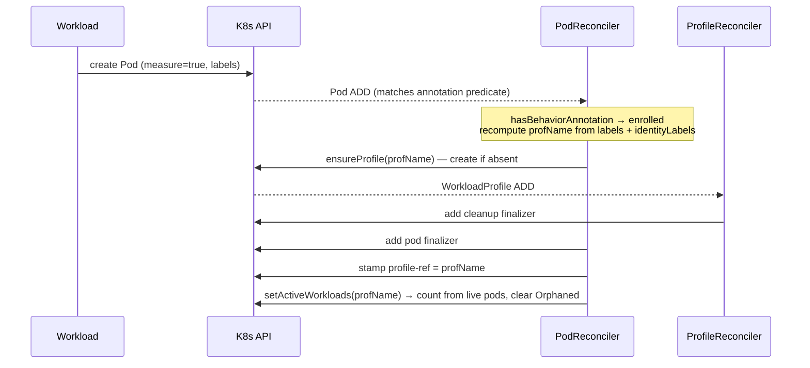
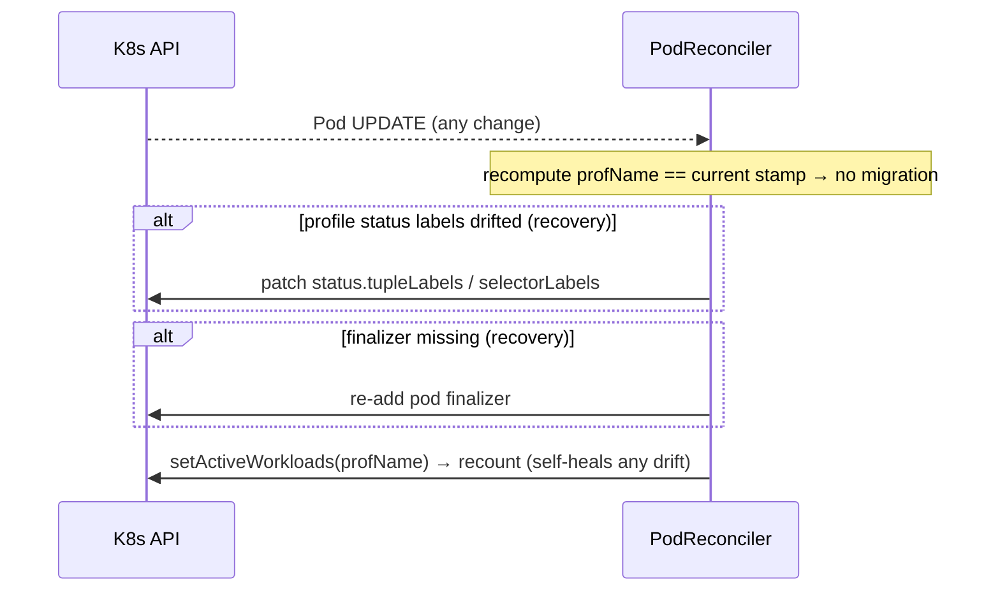
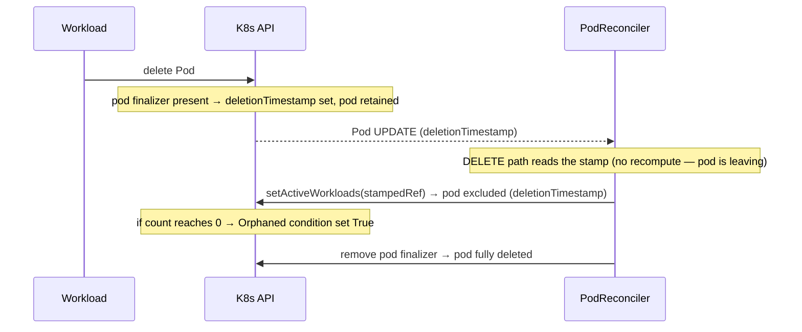
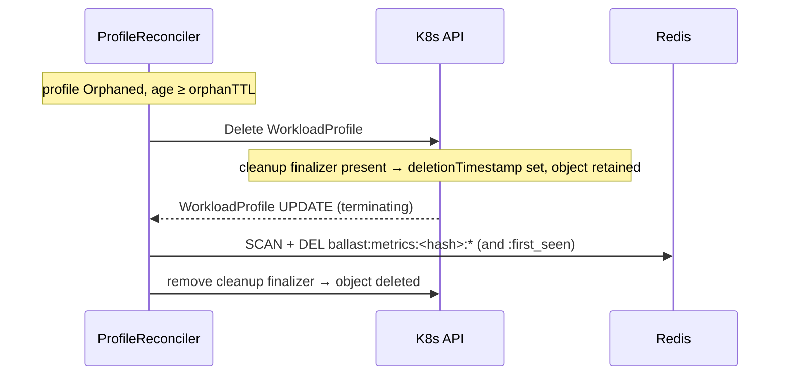
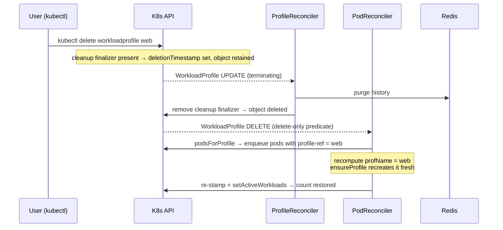
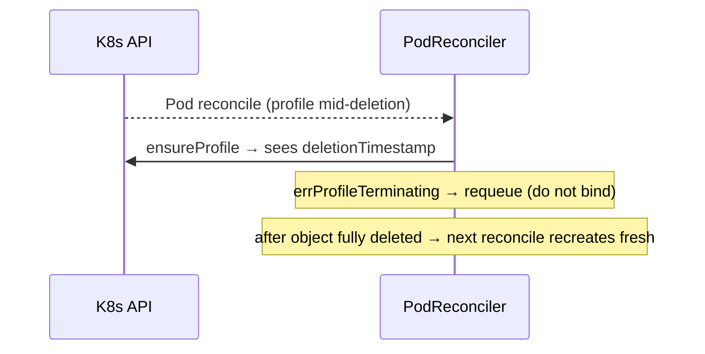
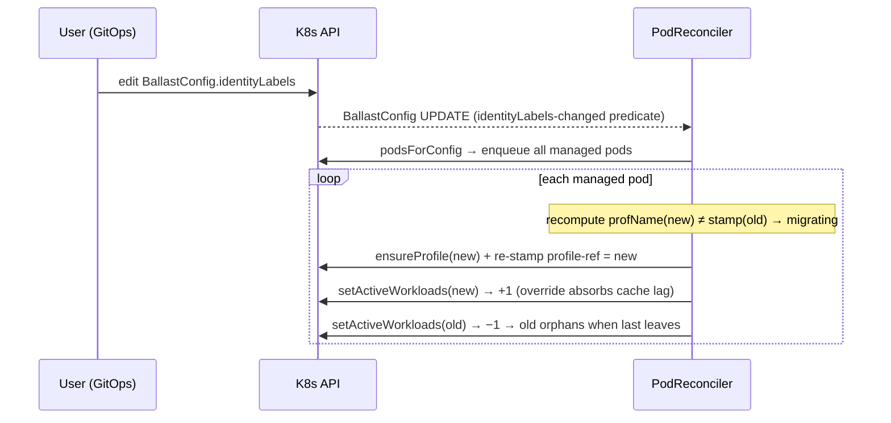
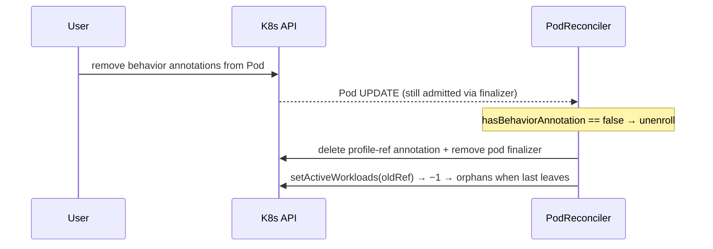
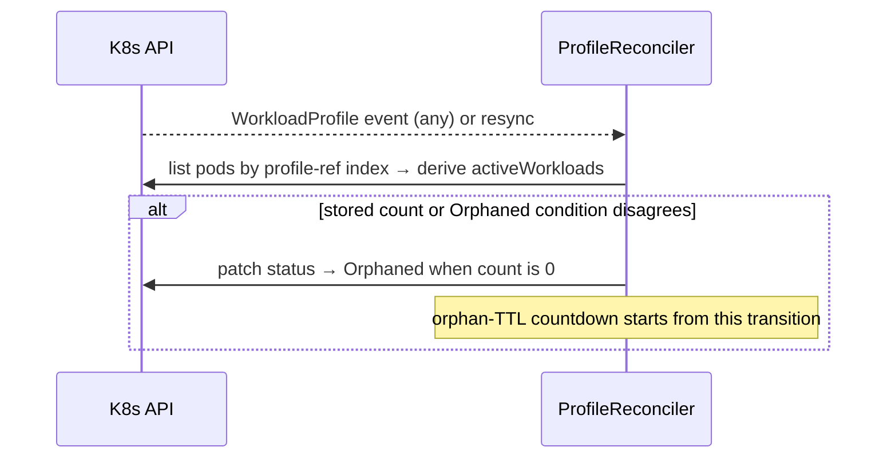

# Convergence Model

> **Canonical reference for enrollment and WorkloadProfile lifecycle.**
> Humans and AI agents: consult this document before changing anything in
> `internal/controller/workloadwatcher/` or the WorkloadProfile finalizer. If you
> change convergence behavior, update the diagrams and invariants here in the same
> change. The sequence diagrams below are the contract; the code implements them.

Ballast converges every workload to exactly one correct `WorkloadProfile` and keeps
each profile's `activeWorkloads` count and Redis history accurate, no matter how the
inputs change (pod churn, annotation edits, `identityLabels` changes, manual profile
deletion). This document shows how.

## Design invariants

These are the load-bearing principles. Every scenario below is a consequence of
them; do not add behavior that violates one without revisiting this document.

1. **`profile-ref` is a deterministic function of identity, not an identity itself.**
   A profile's name is `ProfileName(tupleLabels, identityLabels)`. Any pod with the
   same identity computes the same name, so re-association after a delete/recreate is
   automatic and requires no UID/ownerReference bookkeeping. Never model this
   relationship with `metav1.OwnerReference` (wrong cardinality and wrong cascade
   direction).

2. **Annotations and stamps are hints, not the source of truth.** Every pod
   CREATE/UPDATE reconcile recomputes the desired profile from the pod's *current*
   labels and the *current* `identityLabels`, then reconciles toward it. The stamp
   is a cache used only on the DELETE path (where the pod is leaving and there is
   nothing to recompute). The same applies to the profile's own status: each
   reconcile converges `status.tupleLabels` / `status.selectorLabels` to the
   recomputed values, so a lost initial status write (conflict, crash, older
   operator version) heals on the next reconcile of any member pod.

3. **Counts are level-triggered, never incremental.** `setActiveWorkloads` derives
   the count by listing the profile's member pods and counting live ones, so any
   missed or duplicated event self-heals on the next reconcile. It never does
   `count++/count--`. Both reconcilers enforce this. The pod reconciler recounts
   promptly on pod events, but only for profiles some pod still references; the
   profile reconciler independently recounts on every profile event and resync
   (`recountActiveWorkloads`, write-on-change). The backstop is what heals a
   profile stranded with a stale count: a lost trailing recount after a migration
   or un-enrollment, or a pod that vanished without a processed delete event
   (e.g. its finalizer stripped by hand while the operator was down).

   Every recount lists pods through the `PodProfileRefField` cache index (keyed on
   the profile-ref annotation), so its cost scales with the profile's membership,
   not the cluster's pod count. This is load-bearing: the profile reconciler's
   backstop fires on *every* profile status write, including the metrics
   collector's once-per-poll patches, and an unindexed list would deep-copy
   every pod in the cluster on each of those, pinning a core indefinitely on
   large clusters. The index reflects the *cached* annotation, so a pod stamped
   earlier in the same reconcile is usually still indexed under its old ref;
   `countActiveWorkloads` compensates via the self override, which both excludes
   the pod from its old profile's list and inserts it into its new profile's
   count when the index has not yet caught up. Do not filter profile update
   events with a predicate instead; resync delivers update events with
   `old == new`, so any field-diff predicate would also drop the resync events
   the backstop depends on.

4. **Cleanup lives in the finalizer, and only there.** Redis history is purged by the
   WorkloadProfile cleanup finalizer, so every deletion path (orphan-TTL sweep or
   manual `kubectl delete`) clears history exactly once. The finalizer never reaches
   out to mutate sibling Pods — each controller repairs its own object.

5. **Watches are for promptness; the informer resync is the correctness backstop.**
   The pod controller watches WorkloadProfile deletions and `identityLabels` changes
   so convergence is prompt (seconds). Even if a watch event is missed, the ~10h
   resync re-reconciles every pod and converges. Watch predicates are deliberately
   narrow (delete-only; identityLabels-only and filtered to the canonical
   BallastConfig name) to avoid enqueue amplification, since profile status is
   written on every count change. BallastConfig *creation* is also admitted: pods
   reconciled while the config was absent were skipped, and a delete + re-apply
   never fires the update predicate.

6. **The kill switch defers work; it must not lose it.** Enrollment reconciles
   skipped while the kill switch is active requeue every minute, so releasing the
   switch converges promptly (including a one-shot `identityLabels` fan-out that
   fired mid-outage) instead of waiting for resync. The DELETE path is never
   suppressed, so accounting stays correct throughout.

## Participants

- **W** — the workload / kubelet / user (`kubectl`, GitOps)
- **API** — the Kubernetes API server and the controllers' shared informer cache
- **PodR** — `PodReconciler` (watches Pods; also WorkloadProfile deletes and
  BallastConfig `identityLabels` changes)
- **ProfR** — `ProfileReconciler` (watches WorkloadProfile)
- **Redis** — the metric-history store

---

## 1. Enrollment — a new opted-in pod

## 2. Steady state and self-healing recount

Any subsequent reconcile of an already-correct pod is idempotent: the desired name
equals the stamp, the finalizer is present, and the count is recomputed (a no-op
status patch when unchanged). A partial prior failure (e.g. finalizer missing) is
repaired here without double-counting, because the count is level-triggered.

## 3. Pod termination — decrement and orphan transition

## 4. Orphan TTL — delete and history purge

The only automated deletion path. It fires only when `activeWorkloads == 0`, so no
live pod references the profile.

## 5. Manual delete of a *live* profile — purge, then prompt recreation

Deleting a profile that still has matching pods is a **history reset**, not a
permanent removal: the finalizer clears Redis, then the pod watch promptly recreates
a fresh profile and re-associates only the matching pods (invariant 1).

**Race guard.** If a pod reconciles while the profile is still terminating,
`ensureProfile` observes the `deletionTimestamp` and returns `errProfileTerminating`;
the pod requeues rather than binding to the dying object, then recreates once it is
gone. The same guard covers the cache-lag variant: if the cached Get says NotFound
but the create returns AlreadyExists (the object still exists server-side, either
terminating or freshly created by a sibling pod), the pod requeues and re-evaluates
against a fresher cache instead of binding blind.

## 6. Identity change — migration

Changing `identityLabels` (cluster-wide, via `BallastConfig`) or a pod's own
identity-label values changes the pod's computed profile name. The pod migrates and
the profile it leaves is recounted so it can orphan and age out. A `BallastConfig`
`identityLabels` edit is made prompt by the config watch; a pod-label change is
delivered as an ordinary pod update.

## 7. Behavior-annotation removal — un-enrollment

Removing all Ballast behavior annotations from a running pod un-enrolls it. The pod
is still admitted (it holds the finalizer), so the reconcile runs and tears down the
enrollment: stamp and finalizer removed, old profile decremented.

## 8. Count drift — the profile-side backstop

The pod reconciler's recounts fire only for profiles some pod still references. If
the trailing recount of a migration or un-enrollment is lost (transient API error or
crash after the pod was already re-stamped or un-enrolled), no pod names the old
profile anymore and no pod event will ever recount it. The profile reconciler closes
that hole: on every profile event and on resync it re-derives the count from live pod
state and patches only when the stored count or Orphaned condition disagrees, so the
stranded profile still converges to zero, orphans, and ages out.

A momentary interleaving is possible: the backstop can observe a stamp that is not
yet in its cache and briefly write a lower count. This self-corrects because the
stamp's own watch event re-triggers the pod reconciler after the cache reflects it;
the last write always derives from the freshest state.

## Convergence triggers at a glance

| Change | Prompt trigger | Correctness backstop |
|---|---|---|
| Pod created / updated / deleted | Pod watch | resync |
| `identityLabels` changed | BallastConfig watch (`podsForConfig`) | resync of each pod |
| BallastConfig deleted + re-applied | BallastConfig watch (create admitted) | resync of each pod |
| Behavior annotations removed | Pod watch (finalizer keeps it admitted) | resync |
| Profile deleted (manual or TTL) | WorkloadProfile delete watch (`podsForProfile`) | resync of referencing pods |
| Stale count / lost trailing recount | WorkloadProfile events (`recountActiveWorkloads`) | resync of the profile |
| Profile status labels lost | Next reconcile of any member pod | resync |
| Kill switch released | 1-minute requeue of skipped pods | resync |
| Redis history on any profile delete | Cleanup finalizer | — (single chokepoint) |

## Known limitations

- **Profile-name collisions.** `sanitizeName` can map two distinct identity tuples to
  the same profile name (`Web` vs `web`, `a.b` vs `a-b`). Colliding workloads share
  one profile, and its status labels converge to whichever pod reconciled most
  recently (visible as the tuple labels flapping between the two identities). Avoid
  identity-label values that differ only in case or punctuation.
